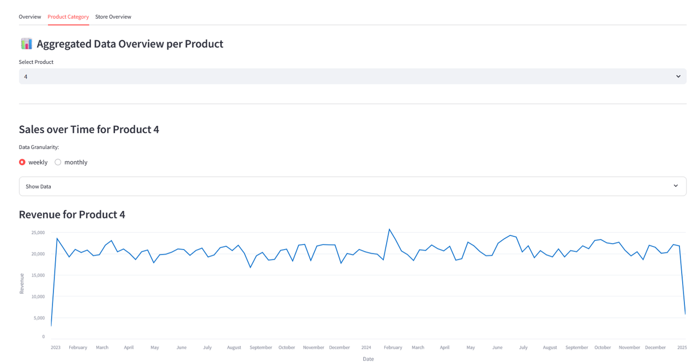
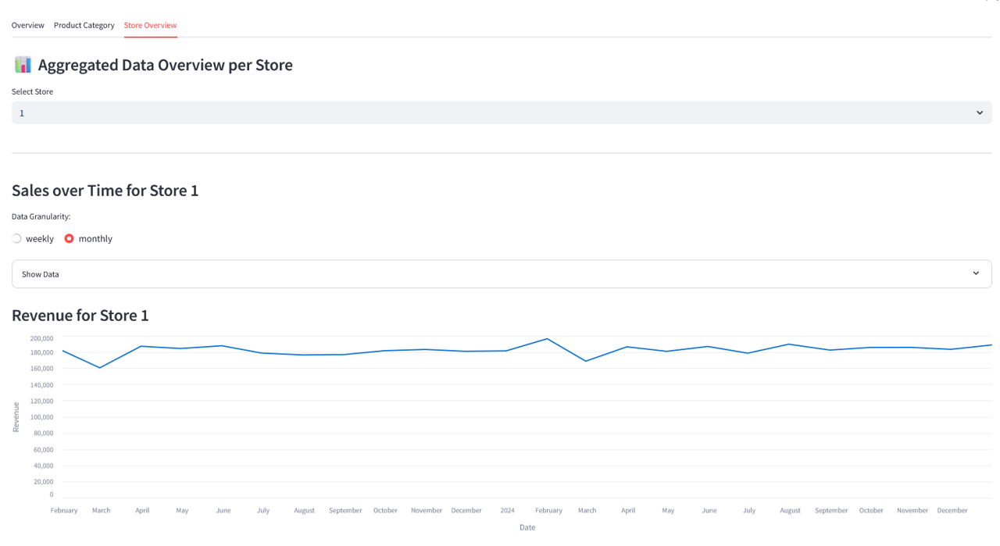
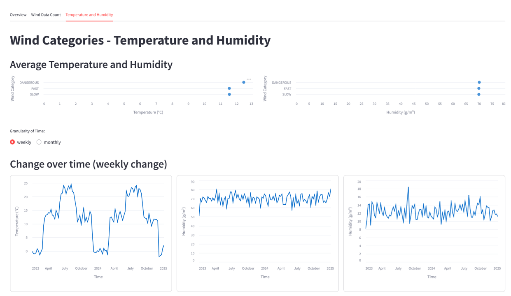
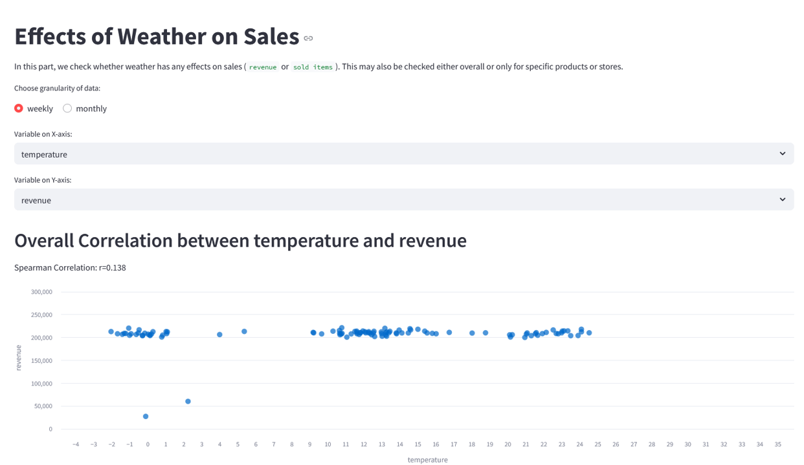

# Lab 4: Dashboard for Gold Layer

Authors: Jakob Staudinger & Tom Scherndl

This is a light-weight Streamlit application visualizing the aggregated Gold‑Layer weather and retail data. We are using parquet files that can be retrieved using MinIO and then will be shown using an interactive Streamlit dashboard. This is just a mockup project to handle backend data architecture and preparation for actual dashboarding. The actual dashboard is very limited in functionality and mostly shows off some simple functionality.

## Prerequisites: How-To Run

Use the `docker-compose.yaml` file to build the container. During startup all parquet files in the `init_minio/gold` folder will be automatically added to MinIO and can then be used in the dashboard. The .yaml file starts up a MinIO and Streamlit container. In order to start all services, just use the following command in the root directory of this repository:

```bash
docker compose up 
```

After starting the container, use [this link](http://localhost:8080) to start the Streamlit app.

## Environment Variables

The following environment variables are used in the `docker-compose.yaml` and may be changed for your purposes.

```code
MINIO_ENDPOINT: http://minio:9000
MINIO_ACCESS_KEY: admin
MINIO_SECRET_KEY: password
BUCKET_NAME_WEATHER: weather-data
BUCKET_NAME_RETAIL: retail-data
```

## About the Streamlit app

The Streamlit app contains a starting page (`Welcome.py`) and multiple pages (in the folder `streamlit_app/pages`) handling retail and weather data as well as a combination of both. It also uses helper functions to load the data (from `helperfile.py`). We decided to use the pages functionality to structure and break the code into meaningful sections.

### 1. Retail and Sale Data Overview

We start with the sales data of the company. In the first tab, you see an overview of the relevant variables as metrics. 


The second tab focusses on the product category and shows the revenue and sold quantity over time. Using the dropdown you can choose which product you want to focus on - the radio box allows switching between a weekly or monthly granularity of the data.  



### 2. **Weather Data Overview:**

In this section we showcase the weather data. You can see the weather data separate for the 3 distinct wind categories and also can see the change over time either in a weekly or monthly granularity.



### 3. **Weather Effects on Sale Data:**

In this section, you can create your own scatter plot for a given variable pair. Whenever you choose the variables for the x- and y-axis, you will get the corresponding scatter plot and the computed correlation coefficient (Spearman) ignoring temporal effects. In the lower part of this section, you can also focus only on either a specific store or product.

